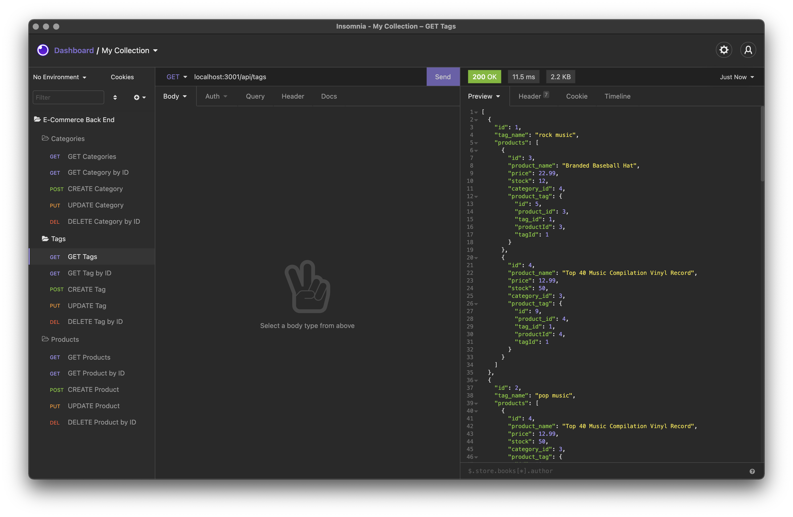
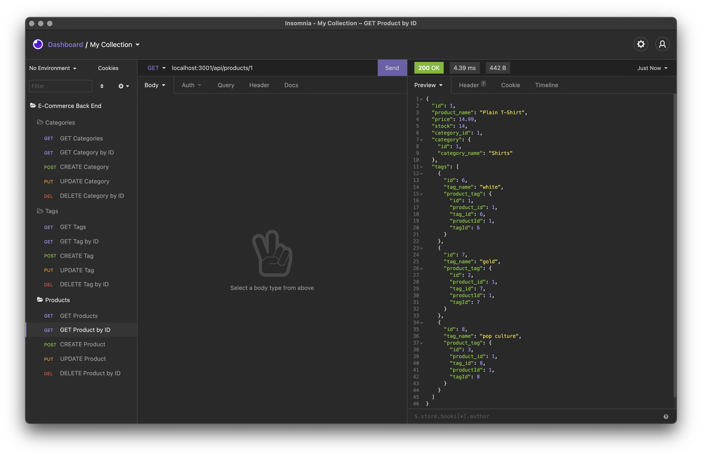

# E-Commerce-Back-End

## Description

This project is an e-commerce back end, it can view categories, tags, and products inside the database. It can also add additional categories, tags, products. As well as update, delete, or find by id for any of the sections. My motivation for creating this project was to hone my skills with API routes and using sequalize. The problem this helps with is companies can use this to manage their back end keep track of products.

## Link to the Project

* [GitHub Repository](https://github.com/ByteSizeError/E-Commerce-Back-End)
* [Walkthrough Video](https://watch.screencastify.com/v/m1lHdgiByGXCUutlnHbc)

## Table of Contents

* [Installation](#installation)
* [Project Demo](#project-demo)
* [Usage](#usage)
* [License](#license)
* [Contributing](#contributing)
* [Tests](#tests)
* [Questions](#questions)

## Installation
  
* To clone the repository
    * Make sure you have right access to pull in the reposotiory either by applying 'ssh' keys or by providing a username and password'
    * Make sure your path is proper
    * Copy the git command to where you want to clone the repository
    ```
    git clone git@github.com:ByteSizeError/E-Commerce-Back-End.git
    ```
    * You will see a `E-Commerce-Back-End` folder.
* An alternate document to clone a repo can also be found at [github](https://docs.github.com/en/github/creating-cloning-and-archiving-repositories/cloning-a-repository-from-github/cloning-a-repository)

## Project Demo

### Filling the Database

* Get to the folder containing the `schema.sql` file
* Run `mysql -u root -p` to start MySQL
* Enter your password for MySQL


* Run `source schema.sql`


* Run `npm run seed`

### Starting the Project

* Run `npm start` to start the server


* Server now running on localhost:3001

### API Requests
<!-- categories -->

* Get all categories by sending `GET` request to `localhost:3001/api/categories`


* Get category by its ID by sending `GET` request to `localhost:3001/api/categories/{id}`


* Create category by sending `POST` request to `localhost:3001/api/categories/` with JSON body
```json
{
    "category_name":"category name"
}
```


* Update category by its ID by sending `PUT` request to `localhost:3001/api/categories/{id}` with JSON body
```json
{
    "category_name":"new category name"
}
```

* Shows the `GET` request for after updating category name

<!-- tags -->

* Get all tags by sending `GET` request to `localhost:3001/api/tags`


* Get tag by its ID by sending `GET` request to `localhost:3001/api/tags/{id}`


* Create category by sending `POST` request to `localhost:3001/api/tags/` with JSON body
```json
{
    "tag_name":"tag name"
}
```


* Update tag by its ID by sending `PUT` request to `localhost:3001/api/tag/{id}` with JSON body
```json
{
    "tag_name":"new tag name"
}
```

* Shows the `GET` request for after updating tag name

<!-- products -->

* Get all tags by sending `GET` request to `localhost:3001/api/products`


* Get product by its ID by sending `GET` request to `localhost:3001/api/products/{id}`


* Create category by sending `POST` request to `localhost:3001/api/products/` with JSON body
```json
{ 
	"product_name": "product name",
	"price": 22.99,
	"stock": 3,
	"category_id": 6,
	"tagIds": [3, 9]
}
```

* Shows the `GET` request for after creating the product


* Update tag by its ID by sending `PUT` request to `localhost:3001/api/products/{id}` with JSON body
```json
{
	"product_name": "new product name",
	"price": 20.99,
	"stock": 10,
	"category_id": 6,
	"tagIds": [1, 3, 9]
}
```


* Delete product by sending a `DELETE` request to `localhost:3001/api/products/{id}`


* Delete tag by sending a `DELETE` request to `localhost:3001/api/tags/{id}`


* Delete category by sending a `DELETE` request to `localhost:3001/api/categories/{id}`

## Usage
* Users can view all categories in the database.
* Users can view all tags in the database.
* Users can view all products in the database.

* Users can view category by ID in the database.
* Users can view tags by ID in the database.
* Users can view products by ID in the database.

* Users can create new categories into the database.
* Users can create new tags into the database.
* Users can create new products into the database.

* Users can update categories in the database.
* Users can update tags in the database.
* Users can update products in the database.

* Users can delete categories in the database.
* Users can delete tags in the database.
* Users can delete products in the database.

## License
  
[](https://opensource.org/licenses/MIT)
  
https://www.mit.edu/~amini/LICENSE.md
  
```MIT License

      Copyright (c) 2021 Jimmy Zheng
      
      Permission is hereby granted, free of charge, to any person obtaining a copy
      of this software and associated documentation files (the "Software"), to deal
      in the Software without restriction, including without limitation the rights
      to use, copy, modify, merge, publish, distribute, sublicense, and/or sell
      copies of the Software, and to permit persons to whom the Software is
      furnished to do so, subject to the following conditions:
      
      The above copyright notice and this permission notice shall be included in all
      copies or substantial portions of the Software.
      
      THE SOFTWARE IS PROVIDED "AS IS", WITHOUT WARRANTY OF ANY KIND, EXPRESS OR
      IMPLIED, INCLUDING BUT NOT LIMITED TO THE WARRANTIES OF MERCHANTABILITY,
      FITNESS FOR A PARTICULAR PURPOSE AND NONINFRINGEMENT. IN NO EVENT SHALL THE
      AUTHORS OR COPYRIGHT HOLDERS BE LIABLE FOR ANY CLAIM, DAMAGES OR OTHER
      LIABILITY, WHETHER IN AN ACTION OF CONTRACT, TORT OR OTHERWISE, ARISING FROM,
      OUT OF OR IN CONNECTION WITH THE SOFTWARE OR THE USE OR OTHER DEALINGS IN THE
      SOFTWARE.
```
  
## Contributing
  
[](code_of_conduct.md)

We as members, contributors, and leaders pledge to make participation in our
community a harassment-free experience for everyone, regardless of age, body
size, visible or invisible disability, ethnicity, sex characteristics, gender
identity and expression, level of experience, education, socio-economic status,
nationality, personal appearance, race, caste, color, religion, or sexual identity
and orientation.

We pledge to act and interact in ways that contribute to an open, welcoming,
diverse, inclusive, and healthy community.

Examples of behavior that contributes to a positive environment for our
community include:

* Demonstrating empathy and kindness toward other people. 
* Being respectful of differing opinions, viewpoints, and experiences. 
* Giving and gracefully accepting constructive feedback. 
* Accepting responsibility and apologizing to those affected by our mistakes, and learning from the experience. 
* Focusing on what is best not just for us as individuals, but for the overall community.
  
Examples of unacceptable behavior include:

* The use of sexualized language or imagery, and sexual attention or
  advances of any kind
* Trolling, insulting or derogatory comments, and personal or political attacks
* Public or private harassment
* Publishing others' private information, such as a physical or email
  address, without their explicit permission
* Other conduct which could reasonably be considered inappropriate in a
  professional setting


This Code of Conduct is adapted from the [Contributor Covenant][homepage],
version 2.1, available at
[https://www.contributor-covenant.org/version/2/1/code_of_conduct.html][v2.1].

Community Impact Guidelines were inspired by
[Mozilla's code of conduct enforcement ladder][Mozilla CoC].

For answers to common questions about this code of conduct, see the FAQ at
[https://www.contributor-covenant.org/faq][FAQ]. Translations are available
at [https://www.contributor-covenant.org/translations][translations].

[homepage]: https://www.contributor-covenant.org
[v2.1]: https://www.contributor-covenant.org/version/2/1/code_of_conduct.html
[Mozilla CoC]: https://github.com/mozilla/diversity
[FAQ]: https://www.contributor-covenant.org/faq
[translations]: https://www.contributor-covenant.org/translations

## Tests
  
Testing can be performed in the command line after installation of the project on the machine. To test the proeject go into the command line and type in 
```
npm i
```
to install all the required modules.
To run and test the program refer to the project demo as a walkthrough to get started.
Type in 
```
npm start
```
If modules are missing type in 
```
npm i
``` 
and follow the instructions for how to fix package issues.

After all required modules are installed should be able to run the program. It will prompt you for project information. Here is where you can test the project.
  
## Questions
  
For questions you can reach me at https://github.com/ByteSizeError.
  
You can also reach me at jimmyz0622@gmail.com for additional questions.
